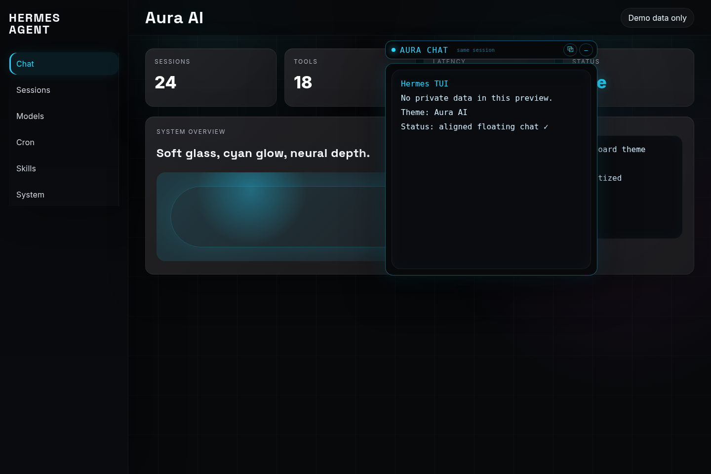
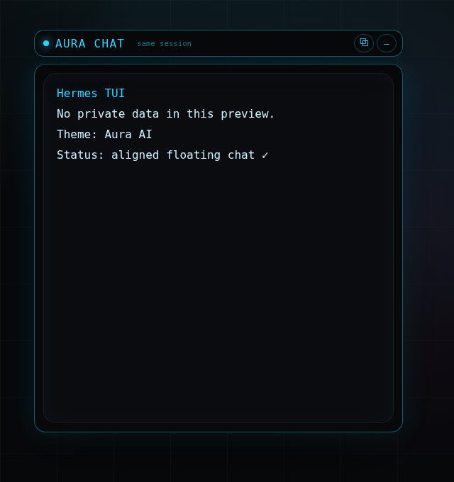

# Hermes Themes

Community-shareable themes for the [Hermes Agent](https://github.com/NousResearch/hermes-agent) dashboard.

## Included themes

### Aura AI

A dark glass dashboard theme with cyan glow, rounded panels, subtle grid texture, and AI-product-dashboard vibes.




## Installation

### Option 1 — install a theme directly from this repository

```bash
mkdir -p ~/.hermes/dashboard-themes
curl -fsSL https://raw.githubusercontent.com/yvigeant/hermes-themes/main/themes/aura-ai/aura-ai.yaml   -o ~/.hermes/dashboard-themes/aura-ai.yaml
hermes config set dashboard.theme aura-ai
hermes dashboard restart 2>/dev/null || systemctl --user restart hermes-dashboard
```

Then refresh the dashboard in your browser.

### Option 2 — clone the repository

```bash
git clone https://github.com/yvigeant/hermes-themes.git
mkdir -p ~/.hermes/dashboard-themes
cp hermes-themes/themes/aura-ai/aura-ai.yaml ~/.hermes/dashboard-themes/
hermes config set dashboard.theme aura-ai
hermes dashboard restart 2>/dev/null || systemctl --user restart hermes-dashboard
```

## Repository structure

```text
themes/
  aura-ai/
    aura-ai.yaml          # Theme file to copy into ~/.hermes/dashboard-themes/
assets/
  screenshots/
    aura-ai/              # Sanitized screenshots with demo-only data
docs/
  theme-authoring.md      # Notes for adding future themes
```

## Adding another theme

1. Create `themes/<theme-name>/<theme-name>.yaml`.
2. Keep screenshots under `assets/screenshots/<theme-name>/`.
3. Use demo data only in screenshots; do not capture API keys, real chats, usernames, tokens, local paths, private repos, or gateway IDs.
4. Add the theme to this README.

## Privacy / shareability checklist

Before publishing screenshots or theme files:

- No tokens, keys, phone numbers, email addresses, chat IDs, or local hostnames.
- No real chat transcripts or private task names.
- No local filesystem paths except generic install paths like `~/.hermes/dashboard-themes`.
- Theme YAML contains only visual configuration.

## License

MIT — see [LICENSE](LICENSE).
